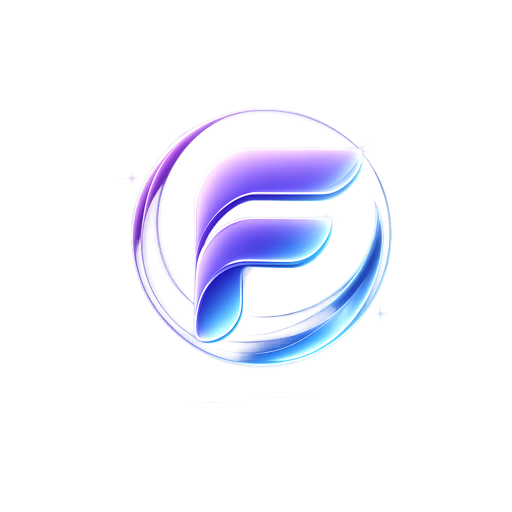

<p align="center">
  
</p>

<h1 align="center">Filka Browser</h1>

<p align="center">
  <b>Следующее поколение премиальных браузеров</b><br>
  <sub>Современный десктопный браузер на Qt 6 / WebEngine с дизайном Liquid Glass</sub>
</p>

<p align="center">
  <a href="#особенности">Особенности</a> •
  <a href="#скриншоты">Скриншоты</a> •
  <a href="#сборка">Сборка</a> •
  <a href="#структура-проекта">Структура</a> •
  <a href="#обновления">Обновления</a> •
  <a href="#лицензия">Лицензия</a>
</p>

<p align="center">
  
  
  
  
  
</p>

---

## Особенности

### Дизайн Liquid Glass
Браузер построен на философии **Liquid Glass** — стеклянные панели с дымчатой прозрачностью, анимированным фоном Aurora и плавными переходами. Безрамочное окно с закруглёнными краями создаёт ощущение современного премиум-продукта.

### Вкладки и рабочие пространства
- **Вертикальные и горизонтальные вкладки** — переключение одним кликом
- **Рабочие пространства** (Work / Dev / Personal / Study) — изолированные наборы вкладок, как в Arc. Переключение мгновенное, страницы не перезагружаются
- **Закрепление вкладок**, сессия восстанавливается при перезапуске

### Встроенный переводчик страниц
- Перевод на **8 языков** прямо на странице — текст заменяется in-place
- Пошаговый перевод длинных страниц без блокировки интерфейса
- Выбор целевого языка, откат к оригиналу
- Работает через нейросеть (API BotHub / Qwen)

### Умная строка адреса
- Поиск и навигация в одном поле
- Автоопределение URL vs поискового запроса
- Индикатор безопасности (HTTPS) и прогресс загрузки
- Горячие клавиши: `Ctrl+L`, `Ctrl+K`, `Alt+D`

### Стартовая страница
- Анимированный фон **Aurora** — три плавающих градиентных сферы с блюром
- Быстрые ссылки на популярные сервисы (YouTube, GitHub, Wikipedia, Reddit, Яндекс, ChatGPT, Twitch, Google Maps)
- Поле поиска с мгновенным откликом

### Другое
- **Закладки** с панелью быстрого доступа
- **История** посещений с относительным временем
- **Загрузки** с прогресс-баром и управлением
- **Поиск на странице** (`Ctrl+F`)
- **Инструменты разработчика** (F12) — отдельное окно
- **Масштабирование** (`Ctrl++` / `Ctrl+-` / `Ctrl+0`)
- **Светлая и тёмная тема** + 7 акцентных цветов
- **Автообновление** — проверка GitHub Releases при запуске

---

## Сборка

### Требования

| Компонент | Минимальная версия |
|-----------|-------------------|
| Qt        | 6.7               |
| CMake     | 3.21              |
| C++       | 20                |
| GCC / Clang | 14+ / 16+      |

### Qt-модули

```
Core Gui Qml Quick QuickControls2 WebEngineQuick Svg Sql Network
```

### Сборка из исходников

```bash
# Клонировать
git clone https://github.com/IgnatTOP/FilkaBrowser.git
cd FilkaBrowser

# Настроить и собрать
cmake -S . -B build -DCMAKE_BUILD_TYPE=Release
cmake --build build -j$(nproc)

# Запустить
./build/app/filka
```

### Установка (Linux)

```bash
cmake --install build --prefix ~/.local
```

### Сборка на Windows

#### Автоматическая (GitHub Actions)

При пуше в `main` или создании тега `v*` автоматически собирается Windows-билд.
Скачать готовый `filka-windows-x86_64.exe` можно из раздела **Actions → Artifacts**.

#### Локальная сборка

Требования:
- **Visual Studio 2022** (MSVC v143+)
- **CMake** 3.21+
- **Qt 6.7+** (модули: Core, Gui, Qml, Quick, QuickControls2, WebEngineQuick, Svg, Sql, Network)
- **Ninja** (рекомендуется) или Visual Studio generator
- **ImageMagick** (для генерации иконки из `logo.png`)

```powershell
# Настроить (от Developer Command Prompt for VS)
cmake -S . -B build -G Ninja -DCMAKE_BUILD_TYPE=Release

# Собрать
cmake --build build --config Release

# Запустить
.\build\app\filka.exe
```

#### Упаковка

```powershell
windeployqt --release --qmldir app/qml build/app/filka.exe
```

---

## Структура проекта

```
FilkaBrowser/
├── app/
│   ├── assets/           # Логотип, SVG-иконки (Lucide-стиль)
│   ├── qml/
│   │   ├── Main.qml      # Корневое окно (Aurora-фон, безрамочный)
│   │   ├── WelcomeDialog.qml
│   │   ├── browser/      # BrowserView, TabPanel, TabStrip, WebPane, StartPage…
│   │   ├── components/   # GlassPanel, IconButton, AddressBar, SidePanel…
│   │   ├── panels/       # HistoryPanel, SettingsPanel, DownloadsPanel, TranslatorPanel
│   │   ├── theme/        # Theme.qml, Motion.qml (дизайн-система)
│   │   └── workspace/    # WorkspaceSwitcher
│   └── src/
│       ├── main.cpp      # Точка входа, настройка Chromium/WebEngine
│       ├── browser/      # TabModel (C++)
│       ├── workspace/    # WorkspaceModel (C++)
│       ├── data/         # HistoryModel, BookmarkModel, PageTranslator, AppSettings
│       └── update/       # UpdateChecker (автообновления)
├── CMakeLists.txt
├── docs/                 # Архитектурные заметки
└── README.md
```

---

## Обновления

Filka автоматически проверяет наличие новых версий через **GitHub Releases** при каждом запуске (с задержкой 3 секунды, чтобы не тормозить старт).

Как это работает:

1. При старте `UpdateChecker` делает запрос к `api.github.com/repos/IgnatTOP/FilkaBrowser/releases/latest`
2. Сравнивает текущую версию (`0.1.0`) с тегом последнего релиза
3. Если версия новее — показывается **UpdateBanner** в верхней части окна
4. Баннер содержит краткое описание релиза и кнопку «Скачать»
5. Скачивание открывает страницу релиза с файлом для вашей платформы (Linux / macOS / Windows)
6. Баннер можно закрыть; повторно не появится до следующего обновления

### Подготовка релиза

Для работы системы обновлений создавайте релизы на GitHub с тегами формата `v0.2.0` и прикрепляйте файлы:

| Платформа | Имя ассета |
|-----------|-----------|
| Linux x86_64 | `filka-linux-x86_64.AppImage` |
| macOS ARM | `filka-macos-arm64.dmg` |
| macOS Intel | `filka-macos-x86_64.dmg` |
| Windows | `filka-windows-x86_64.exe` |

---

## Горячие клавиши

| Действие | Комбинация |
|----------|-----------|
| Новая вкладка | `Ctrl+T` |
| Закрыть вкладку | `Ctrl+W` |
| Фокус на строку адреса | `Ctrl+L` / `Ctrl+K` / `Alt+D` |
| Переключение вкладок | `Ctrl+Tab` / `Ctrl+Shift+Tab` |
| К вкладке 1–8 | `Ctrl+1` … `Ctrl+8` |
| К последней вкладке | `Ctrl+9` |
| Назад | `Alt+←` |
| Вперёд | `Alt+→` |
| Обновить | `Ctrl+R` |
| Поиск на странице | `Ctrl+F` |
| Масштаб + | `Ctrl++` |
| Масштаб − | `Ctrl+-` |
| Сброс масштаба | `Ctrl+0` |
| Инструменты разработчика | `F12` |
| Переводчик | `Ctrl+Shift+T` |
| Полный экран (выйти) | `Escape` |

---

## Технологии

- **Qt 6.7+** — фреймворк с QML, WebEngine, MultiEffect (блюр)
- **Chromium** — встроенный движок через Qt WebEngine с GPU-композитингом
- **Liquid Glass** — кастомная дизайн-система: стеклянные панели, анимации, темы
- **Aurora** — анимированный фон стартовой страницы (три дрейфующих сферы с блюром)
- **C++20** — модели данных (вкладки, рабочие пространства, история, закладки, переводчик)
- **QML** — полностью кастомный UI без нативных виджетов

---

## Лицензия

MIT License. Используйте как хотите.

---

<p align="center">
  <sub>Filka Browser — сделано с вниманием к деталям</sub>
</p>
